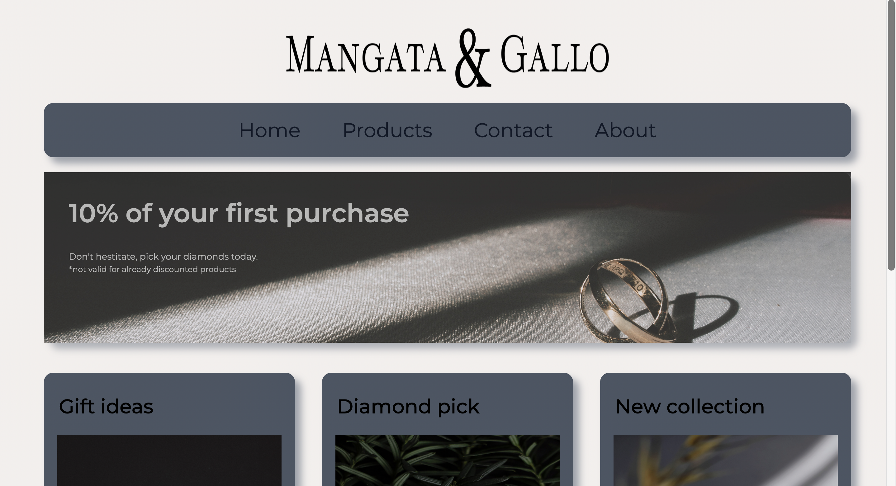
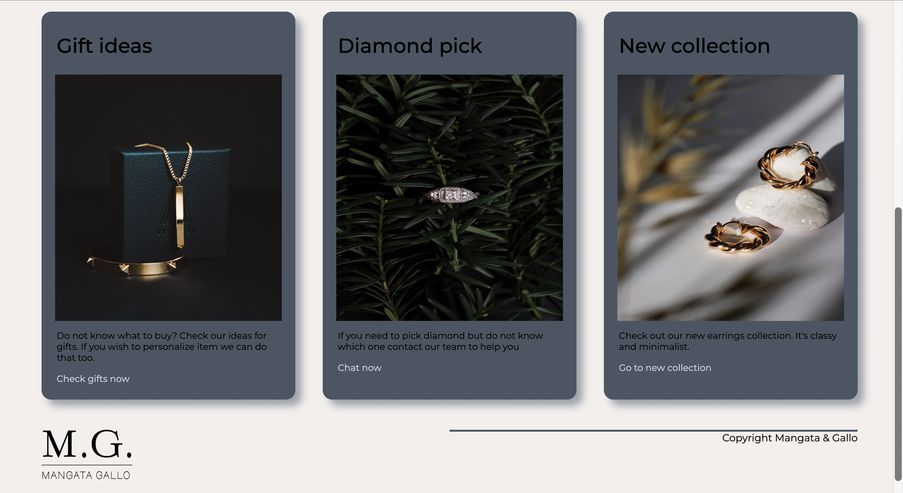

# Jewelry-landing-page

## Table of Contents
* [General Info](#general-information)
* [Technologies](#technologies)
* [Screenshots](#screenshots)
* [Link to webpage](#link-to-webpage)
* [Setup](#setup)
* [Usage](#usage)

## General information
My second landing page. It's a business webpage for jewelry company.

## Technologies
* CSS3
* HTML5

## Screenshots

## Link to webpage
https://agata10.github.io/Jewelry-landing-page/

## Setup

1. Fork repository 
or
2. Clone reposiory
   `git clone https://github.com/YOUR-USERNAME/YOUR-REPOSITORY`

## Usage

This is basic landing page where I wanted to practice working with layout and css effects.